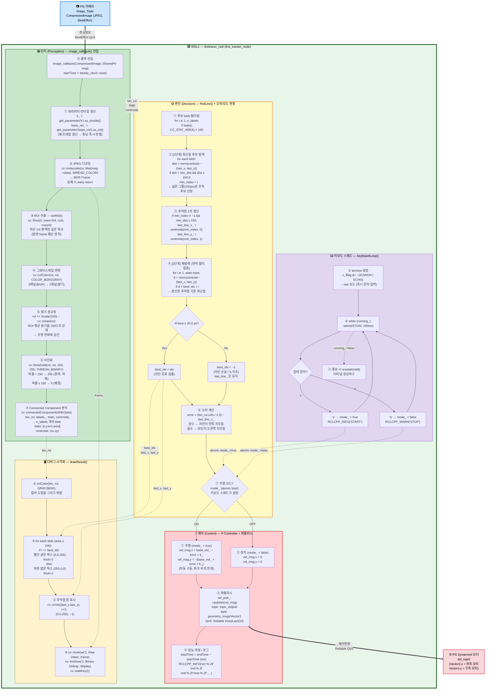
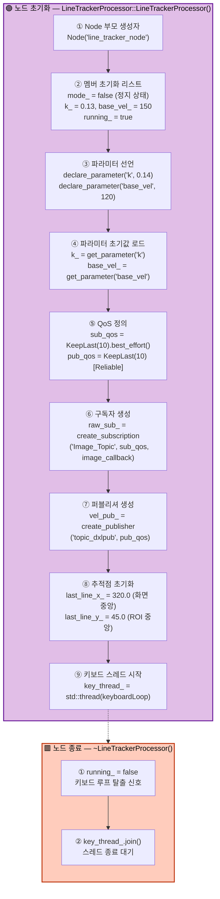

# linetracer_real 블럭도

자율주행 3대 기능(**인지 → 판단 → 제어**)에 따른 `linetracer_real` 노드 상세 블럭도입니다.
인지·판단·제어는 모두 **WSL2 쪽 `linetracer_real` 노드** 안에서 수행되며, 센서(카메라)와 액추에이터(Dynamixel)만 Pi5에 위치합니다.

## 전체 시스템 블럭도

```mermaid
flowchart LR
    subgraph PI5_SENSOR["🔵 센서 (Raspberry Pi5)"]
        CAM["카메라<br/>camera_ros2<br/>libcamerasrc → JPEG"]
    end

    subgraph WSL["🟩🟩🟩  WSL2 — linetracer_real 노드 (자율주행 SW)  🟩🟩🟩"]
        direction LR
        subgraph PERC_BOX["🟢 인지 (Perception)"]
            PERC["영상 전처리<br/>+ 라인 특징 추출"]
        end
        subgraph DECI_BOX["🟡 판단 (Decision)"]
            DECI["라인 확정<br/>+ 오차 계산<br/>+ 모드 결정"]
        end
        subgraph CTRL_BOX["🔴 제어 (Control)"]
            CTRL["P 제어<br/>+ Vector3 퍼블리시"]
        end
        PERC -->|"환경인식<br/>(bin_roi, stats, centroids)"| DECI
        DECI -->|"판단결과<br/>(error, mode_)"| CTRL
    end

    subgraph PI5_ACT["🔴 액추에이터 (Raspberry Pi5)"]
        DXL["Dynamixel 모터<br/>dxl_rapi5"]
    end

    CAM -->|"센싱정보<br/>Image_Topic<br/>CompressedImage<br/>(BestEffort QoS)"| PERC
    CTRL -->|"제어명령<br/>topic_dxlpub<br/>Vector3<br/>(Reliable QoS)"| DXL

    classDef sensor fill:#cce5ff,stroke:#0066cc,stroke-width:2px,color:#000
    classDef wsl_outer fill:#e8f5e9,stroke:#1b5e20,stroke-width:4px,color:#000
    classDef perc fill:#c8e6c9,stroke:#2e7d32,stroke-width:2px,color:#000
    classDef deci fill:#fff9c4,stroke:#f57f17,stroke-width:2px,color:#000
    classDef ctrl fill:#ffcdd2,stroke:#c62828,stroke-width:2px,color:#000
    classDef actuator fill:#f8d7da,stroke:#dc3545,stroke-width:2px,color:#000
    class CAM sensor
    class WSL wsl_outer
    class PERC_BOX,PERC perc
    class DECI_BOX,DECI deci
    class CTRL_BOX,CTRL ctrl
    class DXL actuator
```

---

## 상세 블럭도 (인지 → 판단 → 제어, WSL2 노드 내부)

---

## 초기화 블럭도 (생성자 / 소멸자)

---

## 단계별 상세 요약

### 🟢 인지 (Perception) — WSL2 내부
입력된 압축 이미지로부터 **라인 후보가 될 흰색 blob들**을 추출합니다.

| 단계 | 처리 내용 | 핵심 코드 |
|------|----------|-----------|
| ⓪ | 콜백 진입 / 시간 측정 시작 | `steady_clock::now()` |
| ① | 런타임 파라미터 갱신 | `get_parameter("k"/"base_vel")` |
| ② | JPEG → BGR 디코딩 | `cv::imdecode(msg->data, IMREAD_COLOR)` |
| ③ | ROI 추출 (하단 1/4) | `cv::Rect(0, rows*3/4, cols, rows/4)` |
| ④ | 그레이스케일 변환 | `cv::cvtColor(COLOR_BGR2GRAY)` |
| ⑤ | 밝기 정규화 (평균=100) | `roi += Scalar(100) - cv::mean(roi)` |
| ⑥ | 이진화 (threshold=150) | `cv::threshold(150, 255, THRESH_BINARY)` |
| ⑦ | 연결 요소 분석 | `cv::connectedComponentsWithStats` |

### 🟡 판단 (Decision) — WSL2 내부
이진 영상에서 **진짜 라인을 식별**하고 **오차**와 **주행모드**를 결정합니다.

| 단계 | 처리 내용 | 기준 / 수식 |
|------|----------|------|
| ① | 후보 blob 필터링 | `stats(i, CC_STAT_AREA) > 100` |
| ② | [1단계] 1차 최근접 탐색 | 직전 추적점 기준 `dist ≤ 150px` & 최소거리 |
| ③ | 추적점 1차 갱신 | `last_line_x_, last_line_y_ ← centroid` |
| ④ | [2단계] 재탐색 (면적 필터 X) | 갱신된 추적점 기준 전체 blob 중 최근접 |
| ⑤ | 유효성 판정 | `best ≤ 30.0` 이면 채택, 아니면 `idx = -1` |
| ⑥ | 오차 계산 | `error = (cols / 2.0) - last_line_x_` |
| ⑦ | 주행 모드 확인 | `atomic<bool> mode_` |

### 🔴 제어 (Control) — WSL2 내부
P 제어로 좌우 모터 속도를 계산해 Pi5로 퍼블리시합니다.

| 상태 | 좌측 모터 (x) | 우측 모터 (y) |
|------|--------------|--------------|
| 주행 (`mode_ = true`) | `base_vel_ − error × k_` | `−(base_vel_ + error × k_)` |
| 정지 (`mode_ = false`) | `0` | `0` |

- **P 게인 `k`** (기본 0.14) : 오차에 대한 반응 강도
- **기본 속도 `base_vel`** (기본 120) : 직진 속도
- **퍼블리시 토픽** : `topic_dxlpub` (`geometry_msgs/Vector3`, Reliable QoS)
- **로그** : `err / lvel / rvel / time(ms)` 매 프레임 출력

---

## 핵심 상수 / 임계값 요약

| 심볼 | 값 | 위치 | 의미 |
|------|------|------|------|
| ROI 비율 | 하단 1/4 | `setROI()` | 라인은 화면 하단에만 나타난다고 가정 |
| 목표 평균 밝기 | `100` | `setROI()` | 정규화 기준 |
| 이진화 임계값 | `150` | `setROI()` | 평균보다 +50 밝은 픽셀만 흰색 |
| 최소 면적 | `> 100` | `findLine()` 1단계 | 노이즈 blob 제거 |
| 1차 탐색 반경 | `≤ 150.0` | `findLine()` 1단계 | 프레임 간 움직임 허용 범위 |
| 2차 유효 반경 | `≤ 30.0` | `findLine()` 2단계 | 최종 라인 확정 기준 |
| 초기 추적점 | `(320, 45)` | 생성자 | 640×180 ROI 가정 중앙 |
| `k` 기본값 | `0.14` (선언) / `0.13` (리스트) | 파라미터 | P 제어 게인 |
| `base_vel` 기본값 | `120` (선언) / `150` (리스트) | 파라미터 | 직진 기본 속도 |

---

## 비동기 요소

| 요소 | 역할 | 구현 |
|------|------|------|
| `image_callback` | 인지→판단→제어 메인 루프 | `rclcpp::spin` 콜백 스레드 |
| `keyboardLoop` | `'s'`/`'q'` 키 입력 감지 | 별도 `std::thread` + `termios` raw 모드 + `select` 100ms |
| `mode_`, `running_` | 스레드 간 공유 상태 | `std::atomic<bool>` (lock-free) |
| `last_line_x_/y_` | 프레임 간 추적 상태 | 콜백 단일 스레드 내부 상태 |

---

## 주요 토픽 / QoS 요약

| 방향 | 토픽 | 타입 | QoS | 이유 |
|------|------|------|------|------|
| 구독 | `Image_Topic` | `sensor_msgs/CompressedImage` | **BestEffort** KeepLast(10) | 영상은 최신성이 중요, 손실 허용 |
| 퍼블리시 | `topic_dxlpub` | `geometry_msgs/Vector3` | **Reliable** KeepLast(10) | 모터 명령은 손실되면 안 됨 |
